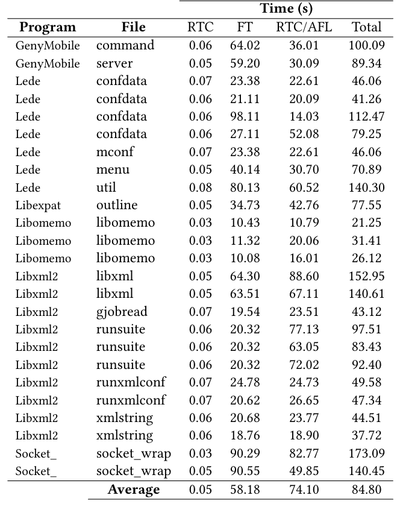

# Weaknesses Testing Tool 
## Towards a Technique to Detect Weaknesses in C Programs.

  A testing technique to reports weaknesses in C programs.

## Abstract

  Several critical systems, such as Linux, are implemented usingC language, and a security flaw in these systems may impact avast number of users. Some tools and strategies are proposed toavoid these security-related issues. Static analysis tools, such asflawfinder and cppcheck, may help in this problem, reporting somekinds of weaknesses. However, they present a high rate of falsealarms, a problem reported in a program when no problem actuallyexists. Despite the effort to provide security support, these systemsstill have weaknesses, leading to vulnerable code. The numberof reported vulnerabilities has been increased in the last years,where more than 18 thousand vulnerabilities were reported to theNational Vulnerability Database (NVD) in 2020. To address thisproblem, we present a technique that associates static analysisand software testing intending to detect weaknesses introducedin the code during earlier development stages of C programs. Weimplement it in a tool called WTT, which reports weaknesses inC programs. To verify our technique’s relevance, we evaluate 103warnings of 6 different projects, and we detect 23 weaknesses ofthree different kinds: Buffer Overflow, Format String, and IntegerOverflow. Overall, our results show evidence that our strategymay help developers anticipate weakness detection in C programs,reducing operational versions’ vulnerability occurrence.
  
## Technique
### Overview

## Evaluation

Table III: Overview of the Selected Subjects.

Table IV: Results of performing WTT on C projects to detect weaknesses; WL = Weakness line; RTC = Run test case; FT = Fuzzing test; NI = Number of inputs; RTC/AFL = Run test cases with AFL inputs; IFTC = Inputs that made the test cases fail; IPTC = Inputs that made the test cases pass.

Table V: Time-consuming of each phase of WTT; RTC = Run test case; FT = Fuzzing test; RTC/AFL = Run test cases with AFL inputs.

### Support or Contact

- Check out our [GitHub](https://github.com/WeaknessesTestingTool/source).
- ...
