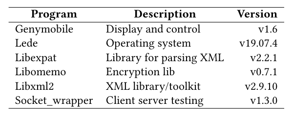

# Weaknesses Testing Tool 
## Towards a Technique to Detect Weaknesses in C Programs.

  A testing technique to reports weaknesses in C programs.

## Abstract

  
 Several critical systems, such as Linux, are implemented usingC language, and a security flaw in these systems may impact avast number of users. Some tools and strategies are proposed toavoid these security-related issues. Static analysis tools, such asflawfinder and cppcheck, may help in this problem, reporting somekinds of weaknesses. However, they present a high rate of falsealarms, a problem reported in a program when no problem actuallyexists. Despite the effort to provide security support, these systemsstill have weaknesses, leading to vulnerable code. The numberof reported vulnerabilities has been increased in the last years,where more than 18 thousand vulnerabilities were reported to theNational Vulnerability Database (NVD) in 2020. To address thisproblem, we present a technique that associates static analysisand software testing intending to detect weaknesses introducedin the code during earlier development stages of C programs. Weimplement it in a tool called WTT, which reports weaknesses inC programs. To verify our technique’s relevance, we evaluate 103warnings of 6 different projects, and we detect 23 weaknesses ofthree different kinds: Buffer Overflow, Format String, and IntegerOverflow. Overall, our results show evidence that our strategymay help developers anticipate weakness detection in C programs,reducing operational versions’ vulnerability occurrence. 

  
## Technique
### Overview

  
 First, our approach receives a C file and executes static analysis withthe aim to identify suspicious code. This phase presents as outputa list of suspicious code snippets (Phase: Static Analysis). Next,we manually isolate the suspicious functions, instrument the code,and generate suitable test cases, according to the kind of weakness.In this phase, we use the AFL and CMocka frameworks (Phase:Instrumentation). The next phases in our technique are automatic.Next, we perform fuzzing testing to verify if the weaknesses causesome crash in the code with the inputs generated by AFL (Phase:Fuzzing testing). In this phase, we store the list of inputs generatedby fuzzing testing to execute the test cases with the stored inputs.Moreover, at the Run Test Cases phase, we execute the test caseswith special values guessed by the developers to verify unexpectedbehaviours caused by the weakness (Phase: Run test cases). Finally,we automatically categorize the set of weaknesses and the list ofinputs that cause failure. Lastly, we generate a categorization witha list of inputs and their results: passed, failed, or crashed (Phase:Categorization).

Figure II: A Testing Technique to Detect Weaknesses in C Programs.

## Evaluation

Table III: Overview of the Selected Subjects.

Figure 4: The Process of Warnings Classification.

Table IV: Overall Precision, Recall, and F1 score; TP = TruePositive; FP = False Positive; TN = True Negative; P = Preci-sion; R = Recall.

Table V: Results of performing WTT on C projects to detect weaknesses; LOC = Lines of code; WL = Weakness Line; CR = CodeReview; RTC = Run test case; FT = Fuzzing testing; NI = Number of inputs; RTC/AFL = Run test cases with AFL inputs; IFTC =Inputs that made the test cases fail; IPTC = Inputs that made the test cases pass; IC = inputs that made crash;

Table VI: Time-consuming of each phase of WTT; RTC = Runtest case; FT = Fuzzing testing; RTC/AFL = Run test caseswith AFL inputs.

### Support or Contact

- Check out our [GitHub](https://github.com/WeaknessesTestingTool/source).
- ...
