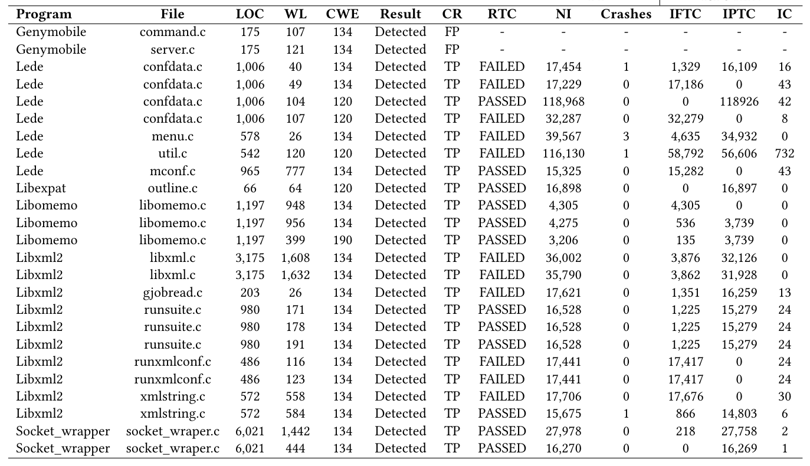

# Weaknesses Testing Tool 
## Towards a Technique to Detect Weaknesses in C Programs.

  A testing technique to reports weaknesses in C programs.

## Abstract

  Several critical systems, such as Linux, are implemented using C language, and a security flaw in these systems may impact a huge number of users. Some tools and strategies are proposed to avoid these security-related issues. Static analysis tools, such as flawfinder and cppcheck, may help in this problem, reporting some kinds of weaknesses. However, they present a high rate of false alarms, a problem reported in a program when no problem actually exists. Despite the effort to provide security support, these systems still have weaknesses, leading to vulnerable code. The number of reported vulnerabilities has been increased in the last years, where more than 17 thousand vulnerabilities were reported to the National Vulnerability Database (NVD) in 2019. To address this problem, we present a technique that associates static analysis and software testing with the aim to detect weaknesses introduced in the code during earlier development stages of C programs. We implement it in a tool called TWT, which reports weaknesses in C programs. To verify our technique’s relevance, we evaluate 49 warnings of 5 different projects and we detect 10 weaknesses of four different kinds: Buffer Overflow, Format String, Integer Overflow, and Race Condition. Overall, our results show evidence that our strategy may help developers anticipate weakness detection in C programs, reducing vulnerability occurrence in operational versions.

## Technique
### Overview

## Evaluation

Table III: Overview of the Selected Subjects.

Table IV: Results of performing WTT on C projects to detect weaknesses; WL = Weakness line; RTC = Run test case; FT = Fuzzing test; NI = Number of inputs; RTC/AFL = Run test cases with AFL inputs; IFTC = Inputs that made the test cases fail; IPTC = Inputs that made the test cases pass.

Table V: Time-consuming of each phase of WTT; RTC = Run test case; FT = Fuzzing test; RTC/AFL = Run test cases with AFL inputs.

### Support or Contact

- Check out our [GitHub](https://github.com/WeaknessesTestingTool/source).
- ...
